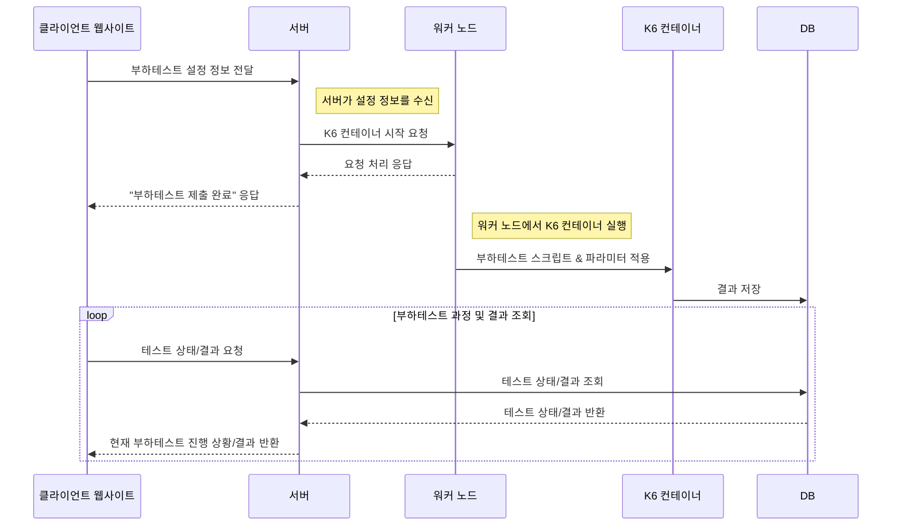
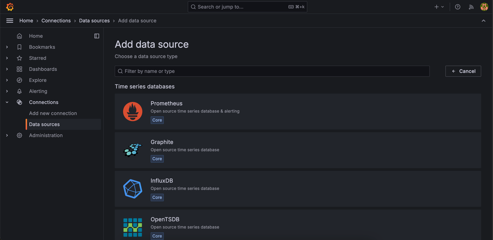
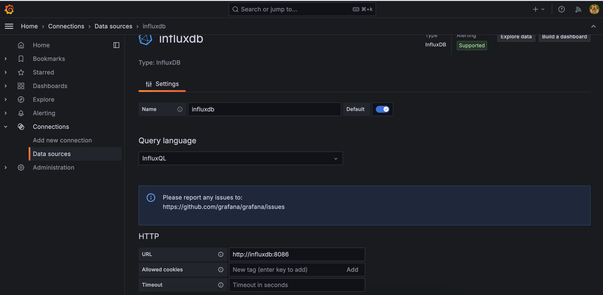
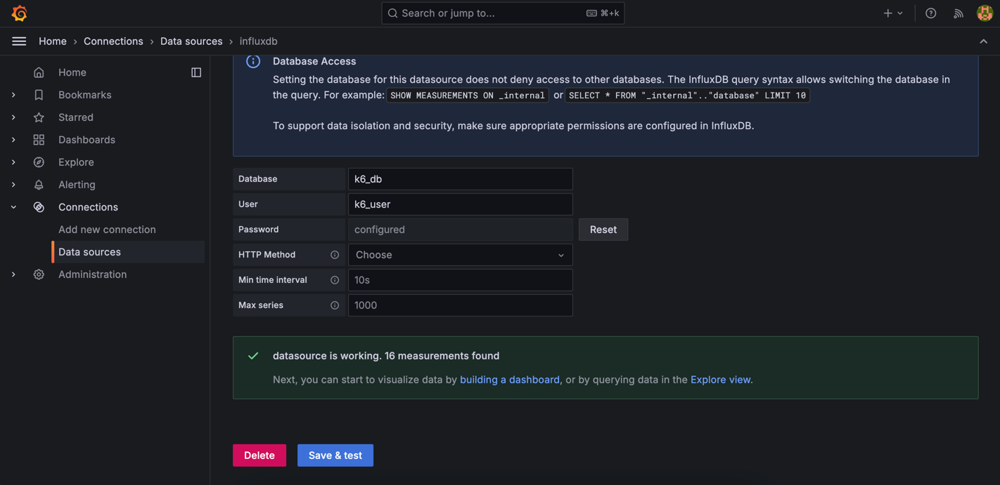
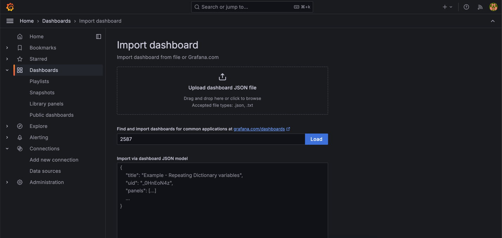
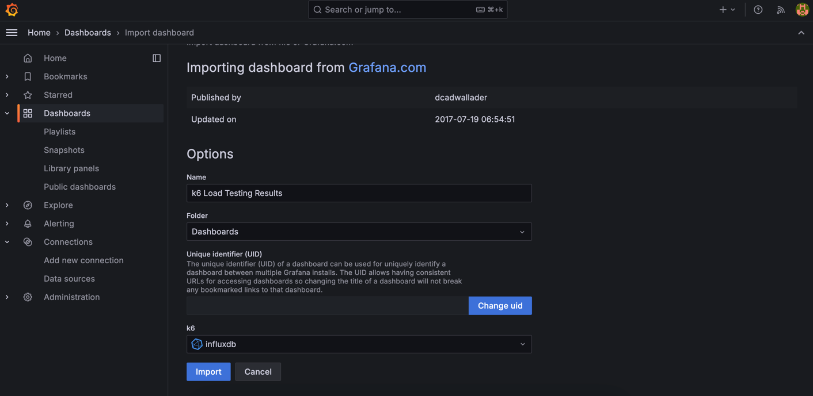
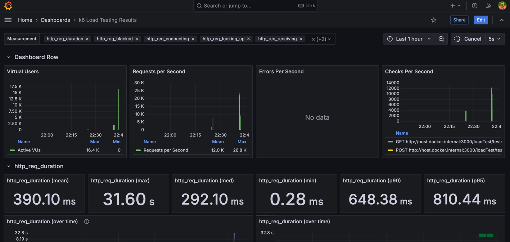

# Load Tester
K6 기반으로 부하 테스트 웹사이트를 만듭니다.



## 데모 실행

```sh
cd server
npm run start
```

```sh
curl --location 'http://localhost:3000/loadTest/run' \
--header 'Content-Type: application/json' \
--data '{
    "tool": "K6",
    "option": {
        "scenarios": {
            "loginScenario": {
                "executor": "constant-vus",
                "vus": 20000,
                "duration": "60s",
                "env": {
                    "url": "http://host.docker.internal:3000/loadTest/test",
                    "method": "GET"
                },
                "data": {
                    "iterationMode": "linear",
                    "headers": [
                        {
                            "Content-Type": "application/json"
                        }
                    ],
                    "body": [
                        {
                            "hello": "world"
                        }
                    ]
                }
            },
            "dataFetchScenario": {
                "executor": "constant-vus",
                "vus": 20000,
                "duration": "60s",
                "env": {
                    "url": "http://host.docker.internal:3000/loadTest/test",
                    "method": "POST"
                },
                "data": {
                    "iterationMode": "random",
                    "headers": [
                        {
                            "Content-Type": "application/json"
                        },
                        {
                            "Content-Type": "application/json"
                        }
                    ],
                    "body": [
                        {
                            "hello": "world"
                        },
                        {
                            "hello1": "world1"
                        }
                    ]
                }
            }
        },
        "thresholds": {
            "http_req_duration": ["p(95)<200"]
        }
    }
}'
```

## 필드 설명
```json5
{
  // HTTP POST 요청의 본문 데이터 시작
  "tool": "K6",
  // 사용하려는 부하 테스트 도구를 K6로 설정
  "option": {
    // 부하 테스트 옵션을 설정
    "scenarios": {
      // 각 시나리오의 설정
      "loginScenario": {
        // 첫 번째 시나리오: 로그인 시나리오
        "executor": "constant-vus",
        // 실행자 유형: constant-vus, 일정한 VU 수를 유지
        "vus": 1,
        // Virtual User(VU) 수: 1명
        "duration": "60s",
        // 시나리오의 지속 시간: 60초
        "env": {
          // 환경 변수 설정
          "url": "http://host.docker.internal:3000/loadTest/test",
          // 요청할 URL
          "method": "GET",
          // HTTP 요청 메서드: GET
          "headers": {
            // 요청 헤더 설정
            "Content-Type": "application/json"
            // 콘텐츠 타입을 JSON으로 설정
          }
        }
      },
      "dataFetchScenario": {
        // 두 번째 시나리오: 데이터 페치 시나리오
        "executor": "constant-vus",
        // 실행자 유형: constant-vus
        "vus": 1,
        // Virtual User(VU) 수: 1명
        "duration": "60s",
        // 시나리오의 지속 시간: 60초
        "env": {
          // 환경 변수 설정
          "url": "http://host.docker.internal:3000/loadTest/test",
          // 요청할 URL
          "method": "POST",
          // HTTP 요청 메서드: POST
          "body": {
            // POST 요청의 바디
            "hello": "world"
            // 요청 바디 내용
          },
          "headers": {
            // 요청 헤더 설정
            "Authorization": "Bearer token123"
            // 인증 헤더
          }
        }
      }
    },
    "thresholds": {
      // 임계값 설정
      "http_req_duration": [
        "p(95)<200"
      ]
      // HTTP 요청 응답 시간이 95%가 200ms 미만이어야 한다는 조건
    }
  }
}
```

## Grafana
1. http://localhost:4000에 접속한 이후 Data source로 InfluxDB를 추가해줍니다. 



2. 현재 데모 docker-compose.yaml에서는 influxDB와 grafana가 같은 네트워크로 묶여있습니다. 따라서 http://influxdb:8086으로 연결해줍니다.



3. docker-compose.yaml에 명시된 database와 user, password를 입력해줍니다.



4. K6 공식 대시보드인 2587를 임포트합니다. 그리고 Load를 누릅니다.



5. Data source로 아까 만든 influxDB를 연결해줍니다.



6. 해당 대시보드에서 부하 테스트를 모니터링 합니다.

