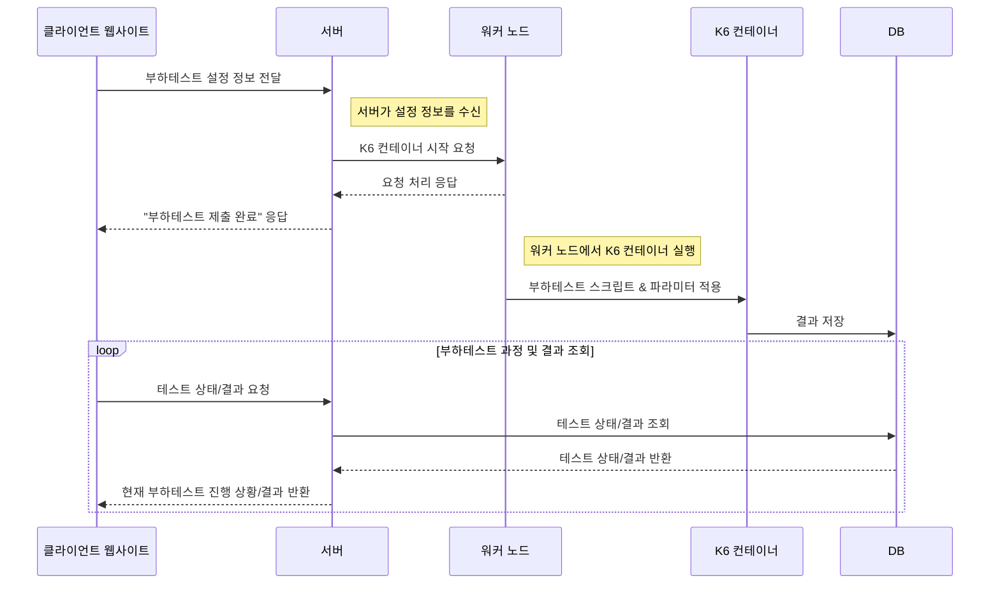

# Load Tester
K6 기반으로 부하 테스트 웹사이트를 만듭니다.



## 실행

```sh
cd server
npm run start
```

```sh
curl --location 'http://localhost:3000/loadTest/run' \
--header 'Content-Type: application/json' \
--data '{
    "baseUrl": "http://host.docker.internal:3000/loadTest/test",
    "vus": 10,
    "duration": "5s"
}'
```